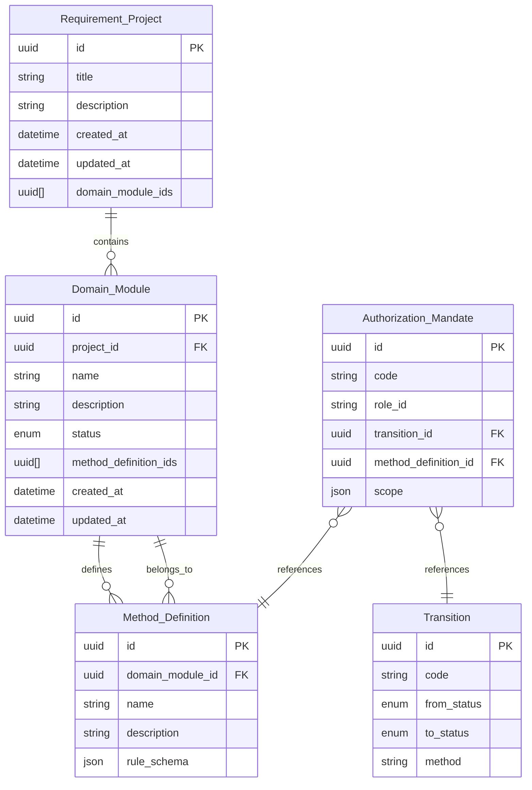

# Entities - сущности домена oor_manager

**Наследование:** Все сущности в этом домене наследуют от [Base] Document (см. [глоссарий](../../glossary/core/README.md)). Это означает, что каждая сущность обладает базовыми атрибутами документа: уникальным идентификатором, заголовком, инициатором, состоянием и жизненным циклом.

Описание сущностей и типов данных для хранения требований в OOR-IDE. Все идентификаторы сущностей - **UUID**.

---

## Наследование атрибутов от [Base] Document

| Атрибут [Base] Document | Соответствие в сущностях OOR-IDE | Описание |
|-------------------------|----------------------------------|----------|
| RegistrationNumber | `id` (UUID) | Уникальный идентификатор сущности |
| Title | `title` (Requirement_Project), `name` (Domain_Module, Method_Definition) | Название/имя сущности |
| Initiator | `created_by` (неявно через `created_at` и контекст пользователя) | Создатель сущности |
| State | `status` (Domain_Module) | Текущее состояние жизненного цикла |
| LifeCycle | `created_at`, `updated_at` | Моменты создания и обновления |

---

## Типы данных (общие)

| Тип | Описание |
|-----|----------|
| **UUID** | Уникальный идентификатор сущности (строка, например `550e8400-e29b-41d4-a716-446655440000`). Используется для Requirement_Project, Domain_Module, Method_Definition, Authorization_Mandate и связей между ними. |
| **JSON** | Структурированные данные: правила проверок (предикаты, условия), метаданные, конфигурация мандатов. Схема конкретного JSON задаётся в описании поля. |
| **enum** | Перечисление допустимых значений (например, статус жизни: Draft, Validated, Frozen). |

---

## Requirement_Project

**Проект требований** - корневой контейнер для набора требований одного проекта/продукта.

**Наследование:** Наследует от [Base] Document.

| Атрибут | Тип | Constraints | Описание |
|---------|-----|-------------|----------|
| `id` | UUID | PK, Not Null | Идентификатор проекта (RegistrationNumber). |
| `title` | string | Not Null, Length: 1-200 | Название проекта (Title). |
| `description` | string (optional) | Length: 0-2000 | Описание проекта. |
| `created_at` | ISO 8601 datetime | Not Null | Момент создания (LifeCycle). |
| `updated_at` | ISO 8601 datetime | Not Null | Момент последнего обновления (LifeCycle). |
| `domain_module_ids` | UUID[] | Default: [] | Список идентификаторов доменных модулей (Domain_Module), входящих в проект. |

**Связи (Relationships):**
- **(1:N) с Domain_Module:** Один проект может содержать множество доменных модулей.

---

## Domain_Module

**Доменный модуль** - логический модуль внутри проекта (например, подсистема или слой OOR: сущности, переходы, правила). Связан с жизненным циклом (статус Draft / Validated / Frozen).

**Наследование:** Наследует от [Base] Document.

| Атрибут | Тип | Constraints | Описание |
|---------|-----|-------------|----------|
| `id` | UUID | PK, Not Null | Идентификатор модуля (RegistrationNumber). |
| `project_id` | UUID | FK(Requirement_Project.id), Not Null | Ссылка на Requirement_Project. |
| `name` | string | Not Null, Length: 1-100 | Имя модуля (например, `oor_manager`) (Title). |
| `description` | string (optional) | Length: 0-2000 | Описание модуля. |
| `status` | enum | Not Null, Values: `Draft` \| `Validated` \| `Frozen` | Текущий статус (State). |
| `method_definition_ids` | UUID[] | Default: [] | Идентификаторы определений методов/операций (Method_Definition). |
| `created_at` | ISO 8601 datetime | Not Null | Момент создания (LifeCycle). |
| `updated_at` | ISO 8601 datetime | Not Null | Момент последнего обновления (LifeCycle). |

**Связи (Relationships):**
- **(N:1) с Requirement_Project:** Принадлежит одному проекту.
- **(1:N) с Method_Definition:** Содержит множество определений методов.

Переходы между статусами задаются в [Transitions](Transitions.md).

---

## Method_Definition

**Определение метода (операции)** - описание операции над сущностями или перехода (например, "создать требование", "перевести в Validated"). Используется для трассировки и привязки мандатов.

**Наследование:** Наследует от [Base] Document.

| Атрибут | Тип | Constraints | Описание |
|---------|-----|-------------|----------|
| `id` | UUID | PK, Not Null | Идентификатор определения (RegistrationNumber). |
| `domain_module_id` | UUID | FK(Domain_Module.id), Not Null | Ссылка на Domain_Module. |
| `name` | string | Not Null, Length: 1-100 | Имя метода (например, `approve`, `freeze`) (Title). |
| `description` | string (optional) | Length: 0-1000 | Описание операции. |
| `rule_schema` | JSON (optional) | Valid JSON schema | Схема или идентификатор правила проверки (см. Rules). JSON может содержать: `{ "rule_id": "uuid", "params": { ... } }` или встроенное описание условия. |

**Связи (Relationships):**
- **(N:1) с Domain_Module:** Принадлежит одному доменному модулю.
- **(1:N) с Authorization_Mandate:** Может быть связан с множеством мандатов.

Правила (инварианты) для метода задаются в [Rules](Rules.md); ссылка из `rule_schema` связывает метод с конкретным правилом.

---

## Authorization_Mandate

**Мандат на действие** - назначение роли права на выполнение перехода или операции. Связывает роль и переход.

**Наследование:** Наследует от [Base] Document.

| Атрибут | Тип | Constraints | Описание |
|---------|-----|-------------|----------|
| `id` | UUID | PK, Not Null | Идентификатор мандата (RegistrationNumber). |
| `code` | string | Not Null, Unique, Pattern: `^M-OOR-(ACT|VIEW)-[A-Z_]+$` | Код мандата (например, `M-OOR-ACT-APPROVE`). Уникален в рамках домена. |
| `role_id` | string | Not Null, Values: `Analyst` \| `AI-Developer` \| `Reviewer` | Идентификатор роли. |
| `transition_id` | UUID (optional) | FK(Transition.id) | Ссылка на допустимый переход (Transition). Обязателен, если мандат даёт право на переход состояния. |
| `method_definition_id` | UUID (optional) | FK(Method_Definition.id) | Ссылка на Method_Definition, если мандат привязан к конкретной операции. |
| `scope` | JSON (optional) | Valid JSON schema | Дополнительная область действия: тип сущности, фильтры. Пример: `{ "entity_type": "Domain_Module", "allowed_statuses": ["Draft"] }`. |

**Связи (Relationships):**
- **(N:1) с Transition:** Ссылается на один переход (для Action Mandates).
- **(N:1) с Method_Definition:** Ссылается на одно определение метода.

**Инвариант (см. Rules):** если указан `transition_id`, переход с таким UUID должен существовать в домене. Аналогично для `method_definition_id`.

---

## Диаграмма связей сущностей (Mermaid)

---

## Сводка типов полей

- **UUID** - для всех первичных ключей и ссылок между сущностями.
- **JSON** - для `rule_schema` (Method_Definition), `scope` (Authorization_Mandate) и при необходимости для хранения сложных правил в Rules (предикаты, условия в структурированном виде).

Эти сущности достаточны для хранения требований, доменных модулей, определений операций и мандатов; переходы состояний и правила проверок описаны в [Transitions](Transitions.md) и [Rules](Rules.md).
