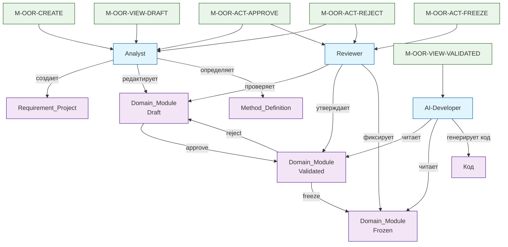

# Домен: oor_manager

Домен управления объектно-ориентированными требованиями в OOR-IDE.

| Раздел | Описание |
|--------|----------|
| [Entities](Entities.md) | Сущности и типы данных для хранения требований |
| [Transitions](Transitions.md) | Жизненный цикл требований (Draft - Validated - Frozen) |
| [Rules](Rules.md) | Правила и инварианты проверок |
| [Mandates](Mandates.md) | Назначение прав ролям на переходы и действия |

Все артефакты домена наследуют от [Base] Document (см. [глоссарий](../../glossary/README.md)).

---

## Workflow домена (Mermaid)



---

## Ключевые концепции

### 1. Наследование от [Base] Document
Все сущности домена (Requirement_Project, Domain_Module, Method_Definition, Authorization_Mandate) наследуют атрибуты базового документа:
- `id` (UUID) - уникальный идентификатор
- `title`/`name` - название
- `created_at`/`updated_at` - жизненный цикл
- Неявный `created_by` - создатель

### 2. Жизненный цикл Domain_Module
- **Draft** - разработка Analyst, редактирование разрешено
- **Validated** - утверждён Reviewer, доступен AI-Developer
- **Frozen** - зафиксированная версия, неизменяема

### 3. Трассируемость
Каждое действие в системе прослеживается через цепочку:
```
UI элемент → Мандат → Переход → Method_Definition → Код реализации
```

### 4. Роли и мандаты
- **Analyst** - создание и редактирование Draft, утверждение/возврат
- **Reviewer** - проверка, утверждение, фиксация версий  
- **AI-Developer** - чтение Validated/Frozen артефактов, генерация кода

---

## Связи между артефактами

1. **Requirement_Project** содержит множество **Domain_Module**
2. **Domain_Module** содержит множество **Method_Definition**
3. **Authorization_Mandate** ссылается на **Transition** и **Method_Definition**
4. **Transition** определяет изменение состояния **Domain_Module**
5. **Rules** проверяют корректность всех операций

---

## Использование в OOR-IDE

Домен `oor_manager` является центральным для работы OOR-IDE:
- **Analyst** использует редактор сущностей для создания требований
- **Reviewer** использует панель проверки для утверждения артефактов
- **AI-Developer** использует панель AI-Sync для получения контекста
- Все действия проверяются через **Mandates** и **Rules**

Подробнее в [сценариях использования](../../scenarios.md).
