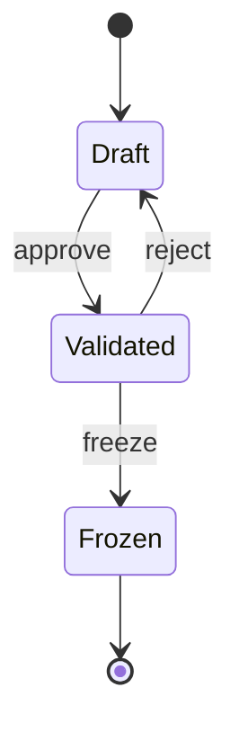

# Transitions - жизненный цикл требований

Переходы состояний применяются к сущности **Domain_Module** (и при необходимости к другим артефактам с полем `status`). Состояния: **Draft** - **Validated** - **Frozen**.

---

## Диаграмма состояний (State Machine)

---

## Состояния (status)

| Состояние | Описание |
|-----------|----------|
| **Draft** | Черновик. Артефакт можно свободно редактировать (роль Analyst). Ещё не утверждён как эталон. |
| **Validated** | Утверждён. Прошёл проверку Reviewer, считается актуальным источником истины (SSOT) для чтения и передачи в AI-Developer. Редактирование возможно только через возврат в Draft (reject). |
| **Frozen** | Заморожен. Неизменяемая версия (например, для релиза). Редактирование запрещено; при необходимости создаётся новая версия в Draft. |

---

## Переходы (Transitions)

Каждый переход имеет идентификатор (UUID в хранилище) и код операции для привязки мандатов. Для трассировки каждый переход связан с конкретным методом.

| Код перехода | From | To | Метод | Описание |
|--------------|------|-----|--------|----------|
| `transition_approve` | Draft | Validated | `approveDomainModule()` | Утверждение артефакта после проверки (Reviewer). |
| `transition_reject` | Validated | Draft | `rejectDomainModule()` | Возврат на доработку (Reviewer или Analyst, по правилам мандатов). |
| `transition_freeze` | Validated | Frozen | `freezeDomainModule()` | Фиксация версии (Reviewer). |

При реализации переходы хранятся как записи с полями: `id` (UUID), `code`, `from_status`, `to_status`, `method`, `description`. Ссылки из [Authorization_Mandate](Entities.md#authorization_mandate) указывают на `id` перехода.

---

## Реестр методов (Methods)

### 1. Domain_Module - методы перехода состояний

| Метод | Описание | Pre-conditions | Actor |
|-------|----------|----------------|-------|
| `approveDomainModule()` | Утверждение артефакта (перевод Draft → Validated) | R-TRANSITION-FROM-STATUS (текущий статус = Draft) | Reviewer, Analyst (с мандатом M-OOR-ACT-APPROVE) |
| `rejectDomainModule()` | Возврат на доработку (перевод Validated → Draft) | R-TRANSITION-FROM-STATUS (текущий статус = Validated) | Reviewer, Analyst (с мандатом M-OOR-ACT-REJECT) |
| `freezeDomainModule()` | Фиксация версии (перевод Validated → Frozen) | R-TRANSITION-FROM-STATUS (текущий статус = Validated) | Reviewer (с мандатом M-OOR-ACT-FREEZE) |

### 2. Domain_Module - методы редактирования (в статусе Draft)

| Метод | Описание | Pre-conditions | Actor |
|-------|----------|----------------|-------|
| `createDomainModule()` | Создание нового доменного модуля | R-PROJECT-EXISTS (проект существует) | Analyst (с мандатом M-OOR-CREATE) |
| `updateDomainModule()` | Редактирование полей модуля | R-STATUS-DRAFT (текущий статус = Draft) | Analyst (с мандатом M-OOR-VIEW-DRAFT) |
| `deleteDomainModule()` | Удаление модуля | R-STATUS-DRAFT (текущий статус = Draft) | Analyst (с мандатом M-OOR-VIEW-DRAFT) |

### 3. Method_Definition - методы управления

| Метод | Описание | Pre-conditions | Actor |
|-------|----------|----------------|-------|
| `createMethodDefinition()` | Создание определения метода | R-MODULE-DRAFT (родительский Domain_Module в статусе Draft) | Analyst (с мандатом M-OOR-VIEW-DRAFT) |
| `updateMethodDefinition()` | Редактирование определения метода | R-MODULE-DRAFT (родительский Domain_Module в статусе Draft) | Analyst (с мандатом M-OOR-VIEW-DRAFT) |
| `deleteMethodDefinition()` | Удаление определения метода | R-MODULE-DRAFT (родительский Domain_Module в статусе Draft) | Analyst (с мандатом M-OOR-VIEW-DRAFT) |

---

## Краткое описание методов

### approveDomainModule()
**Input:** `domain_module_id` (UUID), `comment` (string, optional)  
**Validation:** R-TRANSITION-FROM-STATUS (текущий статус = Draft)  
**Side Effects:** 
- Статус Domain_Module изменяется на Validated
- Обновляется `updated_at`
- Создается запись в истории изменений
- Артефакт становится доступен AI-Developer через M-OOR-VIEW-VALIDATED

### rejectDomainModule()
**Input:** `domain_module_id` (UUID), `reason` (string, optional)  
**Validation:** R-TRANSITION-FROM-STATUS (текущий статус = Validated)  
**Side Effects:**
- Статус Domain_Module изменяется на Draft
- Обновляется `updated_at`
- Создается запись в истории изменений
- Артефакт возвращается Analyst для доработки

### freezeDomainModule()
**Input:** `domain_module_id` (UUID), `version_tag` (string, optional)  
**Validation:** R-TRANSITION-FROM-STATUS (текущий статус = Validated)  
**Side Effects:**
- Статус Domain_Module изменяется на Frozen
- Обновляется `updated_at`
- Создается неизменяемая версия для релиза
- Редактирование артефакта блокируется

### createDomainModule()
**Input:** `project_id` (UUID), `name` (string), `description` (string, optional)  
**Validation:** R-PROJECT-EXISTS (проект существует)  
**Side Effects:**
- Создается новая запись Domain_Module со статусом Draft
- ID модуля добавляется в `domain_module_ids` родительского проекта
- Устанавливаются `created_at` и `updated_at`

### updateDomainModule()
**Input:** `domain_module_id` (UUID), `fields` (object: name, description)  
**Validation:** R-STATUS-DRAFT (текущий статус = Draft)  
**Side Effects:**
- Обновляются указанные поля Domain_Module
- Обновляется `updated_at`
- Проверяются инварианты Rules.md

---

## Именование методов для трассировки

В соответствии со стандартом OOR (см. [Mandates](Mandates.md#6-именование-методов-для-трассировки)) каждый переход должен иметь явное имя метода для однозначной трассировки:

- **Метод** - имя функции/метода в коде, который выполняет переход
- **Связь с мандатами:** Мандаты типа Action (M-OOR-ACT-*) ссылаются на переход, который ссылается на метод
- **Цепочка трассировки:** UI кнопка → Мандат → Переход → Метод → Код реализации

Пример цепочки:
- Кнопка "Утвердить" в UI → Мандат M-OOR-ACT-APPROVE → Переход `transition_approve` → Метод `approveDomainModule()` → Реализация в коде

---

## Условия выполнения перехода

- Текущий статус сущности совпадает с **From**.
- У субъекта (роли) есть мандат на данный переход (см. [Mandates](Mandates.md)).
- Выполнены все [Rules](Rules.md), применимые к этому переходу (инварианты).

Проверки правил выполняются до смены статуса; при нарушении переход блокируется.

---

## Связь с Method_Definition

Каждый переход может быть связан с одной или несколькими сущностями **Method_Definition** для детального описания операции:

- **Method_Definition.name** соответствует полю **Метод** в таблице переходов
- **Method_Definition.rule_schema** содержит правила проверки для перехода
- **Authorization_Mandate** может ссылаться как на Transition, так и на Method_Definition

Пример:
- Transition `transition_approve` связан с Method_Definition `approveDomainModule`
- Method_Definition содержит rule_schema с проверками
- Мандат M-OOR-ACT-APPROVE ссылается на этот Transition

---

## Наследование

Все переходы наследуют от [Base] Document (см. [глоссарий](../../glossary/core/README.md)), что означает:

- Каждый переход имеет уникальный идентификатор (RegistrationNumber)
- Поддерживается версионность и история изменений
- Применимы правила трассируемости и инварианты
